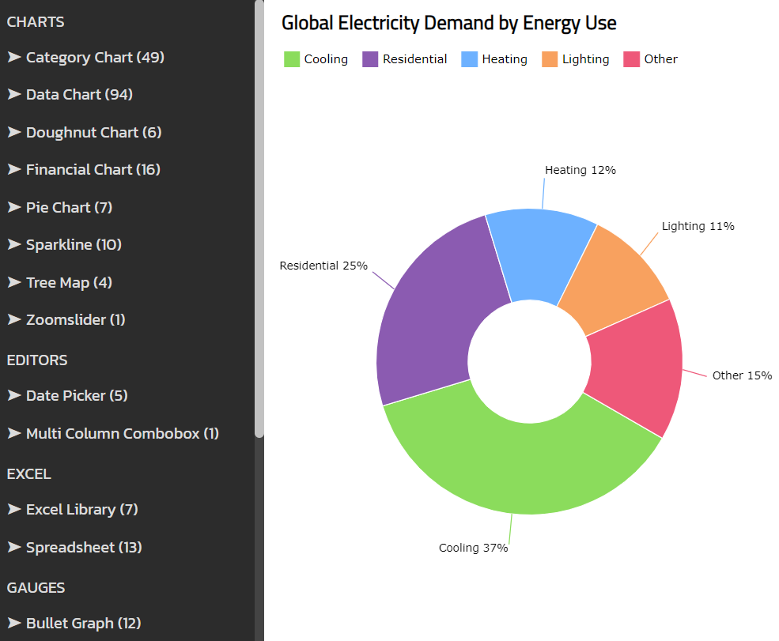

<div style="display: flex; flex-flow: row; font-family: 'Titillium Web'">
    
</div>

# Examples of Ignite UI for Web Components

[](https://github.com/IgniteUI/igniteui-wc-examples/actions/workflows/node.js.yml)

This repository contains over 300 examples on how to use [Ignite UI for Web ](https://www.infragistics.com/products/ignite-ui-web-components/web-components/components/general-getting-started.html) components:

- Charts:
[Area](https://www.infragistics.com/products/ignite-ui-web-components/web-components/components/charts/types/area-chart),
[Bar](https://www.infragistics.com/products/ignite-ui-web-components/web-components/components/charts/types/bar-chart),
[Column](https://www.infragistics.com/products/ignite-ui-web-components/web-components/components/charts/types/column-chart),
[Composite](https://www.infragistics.com/products/ignite-ui-web-components/web-components/components/charts/types/composite-chart),
[Donut](https://www.infragistics.com/products/ignite-ui-web-components/web-components/components/charts/types/donut-chart),
[Financial/Stock](https://www.infragistics.com/products/ignite-ui-web-components/web-components/components/charts/types/stock-chart),
[Line](https://www.infragistics.com/products/ignite-ui-web-components/web-components/components/charts/types/line-chart),
[Pie](https://www.infragistics.com/products/ignite-ui-web-components/web-components/components/charts/types/pie-chart),
[Polar](https://www.infragistics.com/products/ignite-ui-web-components/web-components/components/charts/types/polar-chart),
[Radial](https://www.infragistics.com/products/ignite-ui-web-components/web-components/components/charts/types/radial-chart),
[Scatter](https://www.infragistics.com/products/ignite-ui-web-components/web-components/components/charts/types/scatter-chart),
[Shape](https://www.infragistics.com/products/ignite-ui-web-components/web-components/components/charts/types/shape-chart),
[Sparkline](https://www.infragistics.com/products/ignite-ui-web-components/web-components/components/charts/types/sparkline-chart),
[Stacked](https://www.infragistics.com/products/ignite-ui-web-components/web-components/components/charts/types/stacked-chart),
[Step](https://www.infragistics.com/products/ignite-ui-web-components/web-components/components/charts/types/step-chart),
- Maps:
[Geographic Map](https://www.infragistics.com/products/ignite-ui-web-components/web-components/components/geo-map.html),
[Treemap](https://www.infragistics.com/products/ignite-ui-web-components/web-components/components/charts/types/treemap-chart.html),
- Gauges:
[Bullet Graph](https://www.infragistics.com/products/ignite-ui-web-components/web-components/components/bullet-graph),
[Linear Gauge](https://www.infragistics.com/products/ignite-ui-web-components/web-components/components/linear-gauge.html),
[Radial Gauges](https://www.infragistics.com/products/ignite-ui-web-components/web-components/components/radial-gauge.html)
- Grids:
[Table / Grid](https://www.infragistics.com/products/ignite-ui-web-components/web-components/components/grids/data-grid.html),
[Excel Spreadsheet](https://www.infragistics.com/products/ignite-ui-web-components/web-components/components/spreadsheet_overview.html),
[Excel Library](https://www.infragistics.com/products/ignite-ui-web-components/web-components/components/excel_library_using_workbooks.html)
- Other:
[Dock Manager](https://www.infragistics.com/products/ignite-ui-web-components/web-components/components/layouts/dock-manager),
[Date Picker](https://www.infragistics.com/products/ignite-ui-web-components/web-components/components/editors/date-picker),
[Multi-Column Combobox](https://www.infragistics.com/products/ignite-ui-web-components/web-components/components/editors/multi-column-combobox)


## Branches

> **_NOTE:_** You should use [master](https://github.com/IgniteUI/igniteui-wc-examples/tree/master) branch of this repository if you want to run samples on your computer. Use the [vnext](https://github.com/IgniteUI/igniteui-wc-examples/tree/vnext) branch only when you want to contribute new samples to this repository.

## Preview

You can preview and browse all samples in this repository by opening our [Web Components Browser](https://www.infragistics.com/webcomponents-demos/samples/index). Alternatively, you you can view these samples with detailed information in our [Web Component Documentation](https://infragistics.com/webcomponentssite/components/general-getting-started.html).

In addition, you can run each sample project individually from the [./samples](./samples) folder or you can run from the [./browser](./browser) folder to browse all samples in one website (see instructions below). You can run each sample on Code Sandbox website by clicking on the **Edit Sandbox** button in a readme file of sample project, e.g.

[./samples/charts/category-chart/overview/README.md](./samples/charts/category-chart/overview/README.md)


## Setup

To set up this project locally, clone this repository:
```
git clone https://github.com/IgniteUI/igniteui-wc-examples.git
git checkout master
```

## Running Individual Sample

Follow these instructions to run a single sample on your computer:

- in VS Code, open a folder with existing sample, e.g.

[./samples/charts/category-chart/overview](./samples/charts/category-chart/overview)

- type `npm install --legacy-peer-deps` command in terminal window

- type `npm run start` command in terminal window

- Wait until the build is completed and then open [http://localhost:4200](http://localhost:4200) in your browser.

At this point, you should see a website hosted example of [Ignite UI for Web Components](https://www.infragistics.com/products/ignite-ui-web-components/web-components/components/general-getting-started.html)


## Running All Samples

Follow these instructions to run all samples locally in a browser application.

- open VS Code

- select **View** - **Terminal** menu item

- type `npm install --legacy-peer-deps` command in terminal window

This will install required packages and [Ignite UI for Web Components](https://www.infragistics.com/products/ignite-ui-web-components/web-components/components/general-getting-started.html) packages from npm website:

- [igniteui-webcomponents-core](https://www.npmjs.com/package/igniteui-webcomponents-core)
- [igniteui-webcomponents-core](https://www.npmjs.com/package/igniteui-webcomponents-dashboards)
- [igniteui-webcomponents-charts](https://www.npmjs.com/package/igniteui-webcomponents-charts)
- [igniteui-webcomponents-excel](https://www.npmjs.com/package/igniteui-webcomponents-excel)
- [igniteui-webcomponents-gauges](https://www.npmjs.com/package/igniteui-webcomponents-gauges)
- [igniteui-webcomponents-grids](https://www.npmjs.com/package/igniteui-webcomponents-grids)
- [igniteui-webcomponents-maps](https://www.npmjs.com/package/igniteui-webcomponents-maps)
- [igniteui-webcomponents-spreadsheet](https://www.npmjs.com/package/igniteui-webcomponents-spreadsheet)
- [igniteui-webcomponents-datasources](https://www.npmjs.com/package/igniteui-webcomponents-datasources)

Next, follow these steps:

- type `npm run start` command in terminal window to start the browser application locally

- Wait until the build is completed and then open [http://localhost:4200](http://localhost:4200) in your browser. You should see a website with navigation menu for browning all samples in this repository.



## Adding New Sample

- create a new branch from the `vnext` branch

- open a folder with existing sample, e.g.
```
./samples/charts/category-chart/axis-options/
```
- copy the sample and rename the new folder, e.g.
```
./samples/charts/category-chart/axis-types/
```
- open the newly created folder in VS Code

- rename the .ts file in src folder, using this naming convention:

`ControlNameSampleName.ts`

```
./samples/charts/category-chart/axis-types/src/CategoryChartAxisTypes.ts
```

- open the .ts file

- rename class to the name of .tsx file

- type `npm install --legacy-peer-deps` command in terminal window

- type `npm run start` command in terminal window

- implement the new sample in the .tsx file

- close the new sample project in VS Code

- delete `node_modules` folder in the new sample project

- follow instructions in the next section

## Verify New Sample

- type `npm run start` command in terminal window

- open [http://localhost:4200](http://localhost:4200) in your browser

- verify that the new sample is listed in the navigation menu

- verify that the new sample loads by clicking navigation link

- verify that there are no errors in DEV console

- take a screenshot of the new sample with navigation menu

- commit your changes

- create a pull request and target the `vnext` branch

- paste the screenshot in you pull request

- submit your pull request


## Updating Packages in Samples

NOTE Do NOT find replace version of packages in package.json files. 

- open this repo in VS Code
- open [./browser/tasks/gulp-samples.js](./browser/tasks/gulp-samples.js) file
- navigate to the `updateIG` function
- update version of packages in `packageUpgrades` array
- open terminal window
- run `cd browser` command
- run the `gulp updateIG` command
- run `npm install --legacy-peer-deps` command
- create AND merge a pull request with changes in all package.json files in this repository
- create 2nd pull request with similar changes in `/editor-templates/WebComponents/main-template/package.json` of the [igniteui-xplat-examples](https://github.com/IgniteUI/igniteui-xplat-examples) repository.

## Learn More

To learn more about **Ignite UI for Web Components** components, check out the [Web Components documentation](https://www.infragistics.com/products/ignite-ui-web-components/web-components/components/general-getting-started.html).


# Updating Version of IgniteUI Packages

Perform these steps to update version of **Ignite UI for WebComponent** packages in all samples. NOTE that the order of these steps is very important.

- open this repo in VS Code
- open [gulp-samples.js](./browser/tasks/gulp-samples.js) file
- navigate to the `updateIG` function
- change version of **Ignite UI for WebComponent** packages in the `packageUpgrades` array
- open terminal window
- run `gulp updateIG` command
- run `npm install --legacy-peer-deps` command
- create pull request with your changes
- open the [Igniteui-xplat-example](https://github.com/IgniteUI/igniteui-xplat-examples) repo in VS Code
- update version of **Ignite UI for WebComponent** packages in [WC template](https://github.com/IgniteUI/igniteui-xplat-examples/blob/23.2.x/editor-templates/WebComponents/main-template/package.json)
- create pull request with your changes in [Igniteui-xplat-example](https://github.com/IgniteUI/igniteui-xplat-examples) repo